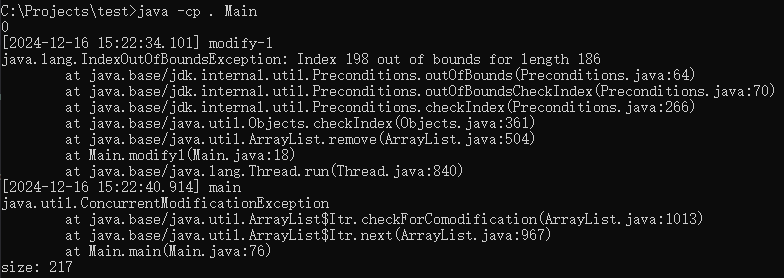
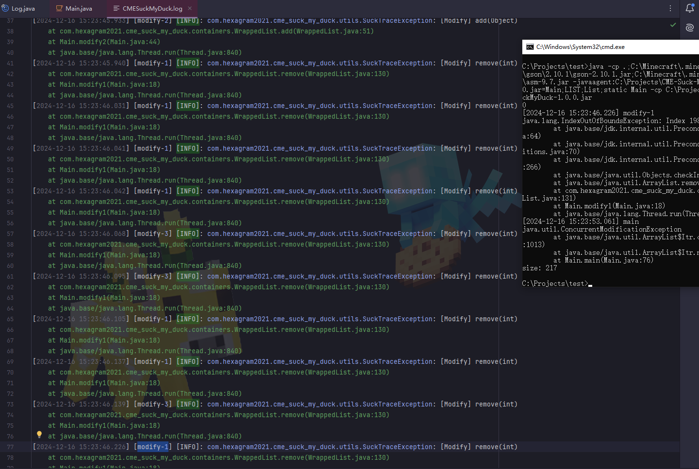

# CME-Suck-My-Duck
Output all stack traces when modifying a certain collection for debugging `ConcurrentModificationException` and `IndexOutOfBoundsException`.

## Usage for Minecraft

First, add this jar to `mods` folder.

Second, edit your Java Virtual Machine Argument in your launcher. Add `-javaagent:mods/CMESuckMyDuck-<version>.jar=<class full name>;<field name>;<type>;<phase>`.

Finally, run the game, play and wait until the crash happens.

## Usage for Other Java Projects

Similar to Minecraft. The only different step is that you should add `gson` and `asm` jar to classpath (-cp) before javaagent, and add our `CMESuckMyDuck-<version>.jar` to classpath after javaagent.

## Arguments

### \<class full name\>

A full name of the class, which has a container that you would like to monitor. Use `\` instead of `.` (a.k.a. the internal name of class).

### \<field name\>

A field name of the container in target class, which you would like to monitor.
For Forge, use SRG name.
For Fabric, use intermediary name.
For NeoForge, use official name.

### \<type\>

Currently, we only support four containers: `List`, `Set`, `Map`, and `Int2ObjectMap` if library "it.unimi.dsi.fastutil" is installed. This argument indicates the type of monitored container.

### \<phase\>

`static` or `nonstatic`. This argument indicates the container is a static field or non-static field.

## Examples

### ConcurrentModificationException from SoundEngine in Forge 1.20.1 Environment

`-javaagent:mods/CMESuckMyDuck-1.0.0.jar=net/minecraft/client/sounds/SoundEngine;f_120229_;Map;nonstatic`

### ConcurrentModificationException from PotionBrewing in Forge 1.20.1 Environment

`-javaagent:mods/CMESuckMyDuck-1.0.0.jar=net/minecraft/world/item/alchemy/PotionBrewing;f_43494_;List;static`

### ArrayIndexOutOfBoundsException from Zeta mod

`-javaagent:CMESuckMyDuck-1.0.0.jar=org/violetmoon/zetaimplforge/event/ForgeZetaEventBus;convertedHandlers;Map;nonstatic`

## Other options

### Log Level

Use system property `-Dcme_suck_my_duck.log_level=<level>` to set custom log level.

Default 1, which means no debug message will be logged. Users can set it to 0 to output debug message.

### ASM API Version

Use system property `-Dcme_suck_my_duck.asm_api_version=<version>` to set ASM API version.

Default 9, which means we use ASM API of version 9.x. For older versions of Minecraft (such as 1.12.2), API level operations such as ASM_9 cannot be applied, so you can set it to a lower value (suck as 5).

### File Max Entries

Use system property `-Dcme_suck_my_duck.file_max_entries=<size>` to set max count of stack traces in each log files.

Default 1000, which means after every 1000 stack traces, old log file will be deleted, and new log file with 1000 stack traces will be renamed, and a newer log file with the latest stack trace will be create - when system crashes, the latest 1001 ~ 2000 stack traces will be accessible in two log files.

### Log Wait Time

Use system property `-Dcme_suck_my_duck.log_wait_time=<milliseconds>` to set wait time of log thread.

Default 500, which means log file I/O will be triggered every half second. All cached stack traces will be logged after log file I/O.


### Whitelist Constructor Stacktrace

Use system property `-Dcme_suck_my_duck.whitelist_constructor_stacktrace=<str>` to set whitelist.

Default empty string, which means all containers will be monitored if class name matches and field name matches. If not empty, the container will only be monitored if any line in the stack trace where the container is constructed includes the content of <str>.

### Transform to Thread Safe

Use system property `-Dcme_suck_my_duck.transform_to_thread_safe=true` to transform the field into a thread-safe container.

This is NOT recommended unless you like slowness and don't want to fix the problem.

### Inject method

Use system property `-Dcme_suck_my_duck.inject_method=true` to switch to inject mode.

If set, you should use `-javaagent:CMESuckMyDuck-<version>.jar=<class full name>;<method name>` and whenever this method is called, you will receive a stack trace in log files.

### Ignore threads

Use system property `-Dcme_suck_my_duck.ignore_threads=<thread name1>;<thread name2>;<thread name3>;...` to ignore some thread that is expected to modify the given container (or call the given method). For example, `-Dcme_suck_my_duck.ignore_threads="Server thread"`.

## Experiments

Code (simulates concurrent modification):

```java
import java.text.DateFormat;
import java.text.SimpleDateFormat;
import java.util.*;

public class Main {
	private static final DateFormat DATE_FORMAT = new SimpleDateFormat("yyyy-MM-dd HH:mm:ss.SSS");
	public static final List<Integer> LIST = new ArrayList<>();
	public static final Random RANDOM = new Random(42);

	private static void modify1() {
		int cnt = 8;

		Random random = new Random(RANDOM.nextInt());
		int a = -1;
		try {
			while (cnt > 0) {
				if (LIST.contains(a)) {
					LIST.remove(a);
					cnt -= 1;
				}
				a = random.nextInt(256);

				try {
					Thread.sleep(RANDOM.nextInt(100));
				} catch (InterruptedException e) {
					System.err.println("[" + DATE_FORMAT.format(new Date()) + "] " + Thread.currentThread().getName());
					e.printStackTrace();
				}
			}
		} catch (IndexOutOfBoundsException e) {
			System.err.println("[" + DATE_FORMAT.format(new Date()) + "] " + Thread.currentThread().getName());
			e.printStackTrace();
		}
	}

	private static void modify2() {
		int cnt = 32;

		Random random = new Random(RANDOM.nextInt());
		int a = random.nextInt(256);
		try {
			while(cnt > 0) {
				if(!LIST.contains(a)) {
					LIST.add(a);
					cnt -= 1;
				}
				a = random.nextInt(256);

				try {
					Thread.sleep(RANDOM.nextInt(100));
				} catch(InterruptedException e) {
					System.err.println("[" + DATE_FORMAT.format(new Date()) + "] " + Thread.currentThread().getName());
					e.printStackTrace();
				}
			}
		} catch (IndexOutOfBoundsException e) {
			System.err.println("[" + DATE_FORMAT.format(new Date()) + "] " + Thread.currentThread().getName());
			e.printStackTrace();
		}
	}

	public static void main(String[] args) throws InterruptedException {
		List<Integer> temp = new ArrayList<>();
		for(int i = 0; i < 200; ++i) {
			temp.add(i);
		}

		LIST.addAll(temp);
		Thread t2 = new Thread(Main::modify2, "modify-2");
		t2.start();
		Thread t1 = new Thread(Main::modify1, "modify-1");
		t1.start();
		Thread t3 = new Thread(Main::modify1, "modify-3");
		t3.start();
		try {
			for(int i: LIST) {
				System.out.println(i);
				t1.join();
				t2.join();
				t3.join();
			}
		} catch(ConcurrentModificationException e) {
			System.err.println("[" + DATE_FORMAT.format(new Date()) + "] " + Thread.currentThread().getName());
			e.printStackTrace();
		}

		System.out.println("size: " + LIST.size());
	}
}
```

w.o. our agent:



with our agent:



With the modification history of `LIST`, we can know which threads cause the crash.